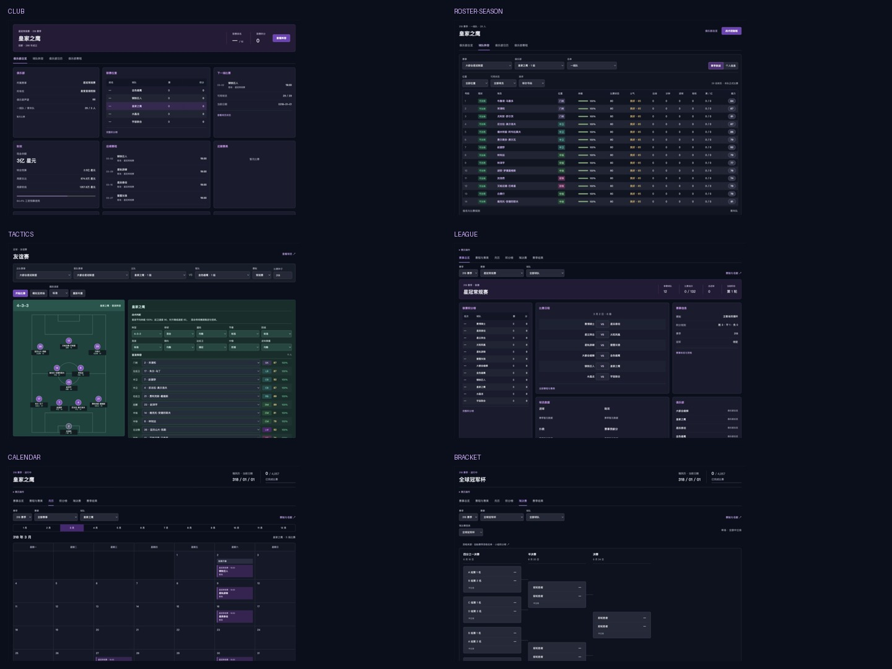

# AstraBall 关键界面设计

2026-09-18。以用户提供的十张截图为视觉与信息结构参考，落到现有游戏页面。人物、俱乐部、赛事、时间与货币均沿用 AstraBall 的世界设定。截图内的按钮文字是参考界面内容，不作为新的任务指令。

## 逐图观察与页面映射

| 参考图 | 观察 | AstraBall 页面与设计 |
| --- | --- | --- |
| 俱乐部阵容一览（赛季数据为主） | 球员名称作为行锚点；状态颜色与细小图形辅助扫描；比赛数据右对齐；上方集中操作与视图选择 | `#squad/sky`：整队表格，赛季数据 / 个人信息切换，位置、可用状态、排序。赛季列为体能、状态、士气、出场、分钟、进球、助攻、纪律与能力 |
| 俱乐部阵容（个人信息为主） | 同一名单更换列集合，号码与名称位置稳定；身份、年龄、身价用于比较 | 同页“个人信息”：出生城市、年龄、身高、惯用脚、合同到期、周薪与参考身价；名称链接打开球员详情并滚动到详情区域 |
| 比赛阵容控制板 | 左侧纵向场地，右侧选人及角色表；绿色专属于战术环境；首发和替补分组 | `#friendly` / `#coach`：纵向首发站位、姓名、号码、位置、能力；右侧阵型及战术选项、首发选择与替补。正式比赛沿用原有保存、换人和执行流程 |
| 俱乐部日历 | 七列日期网格；当天紫色强调；普通安排与赛事事件分层；比赛卡含赛事、时间、对手、主客场 | `#match/calendar/all/sky`：月历优先，12 个月快捷切换，真实赛事与窗口事件；点击日期进入赛程；没有比赛的日期留白 |
| 赛程表 | 日期、对手、主客场、比分和赛事稳定对齐；胜平负不能仅靠比分推断；选中行紫色 | `#match/schedule/all/sky`：俱乐部赛程表，月份切换、选中日期强调、按本队视角标注胜平负；比分保持主队 : 客队；点击结果打开比赛详情 |
| 联赛积分榜 | 排名与球队左侧稳定，统计数字集中排列；资格区边线、近况色块、当前球队强调 | `#match/table/closed`：完整积分榜、近五场胜平负文字与颜色、升级 / 降级 / 资格区；保持原有排名与资格规则 |
| 淘汰赛赛程 | 轮次按列推进，后轮对阵在前轮中心附近；未确定名额不填假球队 | `#match/bracket/global-cup`：四分之一决赛、半决赛、决赛列；固定卡宽；前轮胜者 / 小组名次占位；比赛详情可展开 |
| 欧冠赛事主业 | 赛事身份横幅；左侧阶段、中部比赛与数据、右侧附加信息 | `#match/overview/global-cup`：杯赛身份、阶段、日程、球员数据、规则与参赛俱乐部 |
| 英超比赛主业 | 与杯赛首页共用面板语言，左栏替换为完整联赛表 | `#match/overview/closed`：联赛身份、紧凑积分榜、当轮日程、射手 / 助攻 / 扑救 / 贡献榜和规则 |
| 俱乐部界面 | 多栏经营面板，财务、目标、人员等独立模块；概览中仍保留联赛位置 | `#squad/sky/overview`：身份、声望、所有权、联赛位置、下一场、财政、赛程赛果、培养与规则。经理工作台接入总览、俱乐部日历和阵容入口 |

## 统一规范

- 页面底色 `#0b0f1c`，面板 `#191c2e`，边框 `#34394c`。紫色用于导航、选中与主操作；绿色用于可用状态和战术；红色用于伤停与失利。
- 中文系统无衬线字体；页面标题约 26px，面板标题 13–15px，表格 12px，次要标签 10–11px；数字使用等宽数字特性。
- 全局侧栏保持稳定；页面工具按任务分组；比赛推进收进可展开的“赛历操作”，避免挤占数据区。
- 大屏三栏信息面板；中等宽度两栏；窄屏单栏。表格、月历、签表在自身容器内滚动，不将整页撑宽。
- 行交替底色、悬停、键盘焦点、选中态和清楚的空状态贯穿各页。颜色状态同步显示文字。
- 个人档案、经理、财政、转会、青训与赛事规则使用同一套底色、表头、按钮与面板规范，保留既有业务功能。

## 数据与功能边界

- 阵容赛季统计只计该球员为当前俱乐部参加的已完成正式比赛；不计友谊赛、轮空、未出场替补，也不混入为前东家出场的数据。
- 近期表现来自实际比赛结果。没有赛果显示“暂无比赛”，没有球员数据时保留空状态。
- 能力来自引擎能力值，不冒充参考图中的赛后平均评分；贡献榜沿用游戏现有贡献分模型。
- 参考身价、周薪、预算、现金来自现有合同与经济模型，不是现实币种；没有合同的不显示估算金额。
- 参考中的现实队徽、照片、国旗、英超与欧冠名称不移植进架空世界。沿用现有身份标识；没有给未确认球员套用肖像素材。
- 未新增董事会情绪、新闻轮播、训练日程排班、持球 / 无球两套独立角色等尚无对应模型的系统。现有训练入口和战术参数继续工作，具体设计限制留在本文档。
- 此次没有变更足球模拟、赛制、积分规则或存档结构。

## 预览与证据

本地预览：`http://127.0.0.1:4318/#squad/sky/overview`。

- [参考对比 1：阵容、战术、日历与赛程](screenshots/comparison-1.jpg)
- [参考对比 2：积分榜、杯赛、赛事首页与俱乐部](screenshots/comparison-2.jpg)
- [表格细节对比](screenshots/table-detail-comparison.jpg)
- [窄屏阵容](screenshots/mobile-roster.png)
- [窄屏赛事首页](screenshots/mobile-cup.png)

完整检查记录见项目根目录 `design-qa.md`。
