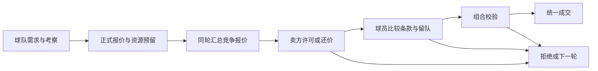

# 球员交易市场设计

状态：多 Agent 讨论后的设计提案，尚未实施。本轮只读审查现有代码并形成方案，没有修改交易规则或运行新的多年模拟。

目标是让每笔交易同时满足买方的球队需要、卖方的放人条件和球员的加盟意愿。明星与被看好的青年可以收到多个独立买家的竞争报价；球员仍可选择留下。

## 当前基础与证据范围

当前 `market.js` 已有现金、转会预算、工资上限、剩余赛季工资预留、合同起止、续约、解约补偿、转会费和签字费，以及账本守恒校验。`market-ui.js` 已有引援、本队合同、交易记录。因此应扩展现有财政与合同，避免新增平行账本。

当前市场的主要缺口：

- `transferQuote()` 使用固定价格和硬条件；AI 卖方通常只出售同位置最弱者，主力很难进入正常谈判。
- `saleOffers()` 即时计算可成交对象，不保存多家俱乐部的竞争报价；买方得到相同转会费。
- 周度 `market.aiReview()` 按日期打乱俱乐部次序后立即签人，没有共同报价、卖方回应和球员择队的轮次。
- 青训半年招募与周度市场存在两套决策入口。`registryMovement()` 已衔接财务，但两套入口的年龄、冷却、人数和用人要求仍不同。
- `observeYouth()` 已从实际成长和比赛证据形成带稳定偏差的预测，不读取真实 PA；目前不能直接覆盖全部原始职业球员。

此前冻结二十季末的 75 支深度不足球队，全部是天然中卫少于三人：5 队没有、18 队一人、52 队两人。该世界共有 928 名在队中卫，268 队各三人的静态目标需要 804 名。52 支缺中卫球队同时超过 25 名成年球员，22 支仍可在人数限制内增加成年球员。这支持检查配置、补员决策和报名约束，不能单凭总量认定任意中卫都能转去任意球队。

上述结果来自[旧规则与机会修复的冻结对照](青训机会与流动验证.md)。审计脚本直接 `createSeason()`，没有初始化财政；当前真实页面 `store.loadSeason()` 会初始化财政。旧结果不能直接当作现有完整财政市场的多年表现。后续须另外建立财政基线，再与新市场配对比较。

## 球队先确定用途

每队维护有期限的需求单，来源于真实阵容、合同和赛程。成交、退役、租借归队、报名改变后重新评估；常规市场按周更新，避免每次打开页面重新抽取需求。

| 用途 | 触发 | 采购要求 |
|---|---|---|
| 紧急补位 | 无法用合格球员覆盖比赛岗位 | 能及时取得资格并胜任；先保必要位置 |
| 轮换深度 | 主力缺席后出现明显能力落差或不合格客串 | 能胜任替补和轮换，不要求超过现有主力 |
| 首发升级 | 某岗位明显弱于球队竞技目标 | 加入后的完整首发配置有足够改善 |
| 年龄接班 | 关键岗位集中老化、合同将到期且缺继任者 | 可以先轮换并逐步接班 |
| 青年培养 | 有训练资源及实际比赛路径 | 本队球探看好，风险与成本可承受 |
| 明星机会 | 高水平球员进入市场 | 有明确战术用途，且不挤占必要补位的资源 |

需求保存岗位、优先级、最低可用水平、预期角色、机会预算、费用上限和截止时间。优先给紧急补位与基本轮换留钱，再评估明星和青年投资；不将所有预算集中在最知名的一个人身上。

评价候选时计算加入后的首发提升、关键缺阵时的改善、预计分钟、被挤出球员和全合同成本。第三中卫能够降低阵容脆弱性，即使不提高最强首发评分，也有明确价值。

保留原天然 GK/CB 人数统计，增加基于 `roleFit/aiRoleScore/planAITeam` 的有效覆盖诊断：按常用阵型排首发，再逐一移除关键首发，检查能否由不同的合格球员补位。万金油不能同时被计为几个独立替补。次位置需满足相对本队或联赛的公开实力门槛，不能仅有标签就算合格。

两中卫阵型与三中卫阵型可有不同深度目标；短暂伤病触发应急安排，不自动变成永久囤人的理由。先使用原生成参数，观察交易与报名修复后的供需，再决定是否需要调整青训位置选择。

## 价格与卖方意愿

将市场参考价、买方最高愿付、卖方最低接受价分开保存。

| 数值 | 依据 |
|---|---|
| 参考价区间 | 可见表现、年龄、合同剩余期、岗位稀缺及已积累声望 |
| 买方最高愿付 | 本队阵容收益、预计使用量、球探成长预期，减去工资、风险和其他需求的机会成本 |
| 卖方最低接受 | 失去球员的竞技损失、替代成本、合同与续约前景、财政压力和出售意愿 |

关注者多不直接提高真实能力、预测上限或买方预算。竞争可以促使报价接近既定上限；新的比赛或合同证据可以在之后的轮次重新形成估值，但不能通过反复刷新无证据抬价。首版没有相应收入模型时，不给明星凭空增加商业收入。

卖方将球员分为核心、听取报价、愿意出售、可外租和暂缺替代者。出售核心的硬条件是仍保留合格的比赛覆盖，竞技水平下降则进入报价权衡；不能要求找到同等水平的明星才准出售。无合格覆盖时可以拒绝，并产生独立补员需求。

首版允许同级、向上、向下和跨体系的普通合同转会，仍尊重皇家学院选秀权等既有资格。三十岁以上的合格轮换球员不应被统一候选年龄上限排除。合同到期的流动按到期规则处理，覆盖缺口产生补员需求，不能用卖方保护无限延长过期合同。

首版不允许依靠尚未完成的另一笔交易满足出售条件，也不提前花掉预期卖人收入。替代者可以先独立签入，再出售原球员。有限的关联交易留给后续版本，避免循环依赖。

## 明星和青年怎样获得多队关注

明星的关注来自已经证明的竞技水平、表现、比赛舞台和稀缺岗位。青年兴趣来自本队的观察报告、年龄、成长轨迹、比赛环境与不确定性。

市场俱乐部只消费公开或本队已经取得的观察信息，不读取 `potential`、`growthProfile.ceilings` 或身体成长上限。球员本人的隐藏偏好可参与自身选择，但不直接暴露给俱乐部估值器。

将现有观察机制扩展为覆盖全部可交易球员的接口。不同球队可以有不同观察范围、稳定偏差与风险偏好；相同证据反复刷新不会重新抽签。信息少时保持较宽区间，不能把“尚未观察”解释为“没有潜力”。

观察者可能共同看好一个青年，也可能漏掉真正的高潜力球员、争抢最终未兑现的人。这些结果来自信息与判断差异，不人为给每名高 PA 球员安排固定数量的买家。竞争消息可以促使他队考察，但不能证明潜力。

首版限制每周新增考察目标与每项需求短名单规模；仅为实际关注的球员保存球队报告。禁止所有球队每天扫描所有隐藏属性或为每对球队与球员创建永久观察对象。

## 报价轮次与球员选择

建议每周在注册窗口内建立一次市场批次，最多三轮谈判。轮数是待校准的游戏参数。每轮在明确的游戏日期截止，报价有真实响应时间；用户未推进日期时不会过期。临近窗口结束时缩短或停止启动新批次，规则公开，不让协议悄悄越窗成交。

每项需求可考察和询价多名候选，首版同时只保留一份正式有效报价。不同需求可以并行，但必要位置预算事先隔离。明确拒绝后立即释放预留；报价自然到期也释放。批次安排需留出转向备选的时间，窗口末期的紧急补员降低对热门目标的冒险。

正式报价包含转会费、签字费、周薪、合同期限、预期角色、报名安排、有效期限和版本。现金、工资空间及计划报名容量均须预留；预留不是已付款。既有合同和其它有效报价的承诺必须合计检查，不能重复使用同一份预算。

各队基于同轮共同快照生成报价，报价收齐后才统一响应。卖方可许可多份达到可接受条件的报价；对同一球员的多份许可不代表多个出售名额。球员只比较卖方许可的方案，保留留队或暂不签约选项。

球员比较待遇、可兑现的机会、竞技目标、赛事水平、已实现的培养环境、适应成本和留队价值。偏好在球员身上稳定保存并随生涯事件缓慢变化。青年可以重视上场与发展，明星可以重视竞技目标，但年龄不直接决定唯一选择。不要因每次按钮点击或微调工资重新抽取意愿。

同一批多笔交易还须联合检查：买家是否同时买入互相挤占机会的人，卖家是否同时送走互为替补的人。卖方许可只是谈判资格；最终按买卖双方完整拟成交集合验证，不依赖尚未完成的出售收入或替代者。

冲突先服从资格、预算与覆盖约束，再按已经固定的球队交易效用和需求优先级裁决；同值使用保存的稳定种子。裁决结果与输入数组、俱乐部遍历顺序无关。失败者可以在剩余轮次转向备选，轮次用尽则记录具体原因，不自动放松规则。最终先确定完整可成交集合，写入顺序只负责落盘。

## 出场承诺与培养计划

角色使用核心、主力、轮换、培养等清晰标签，并对应可解释的预期出场范围。承诺进入全队与岗位的机会预算，不能给竞争同一岗位的三个人都承诺稳定主力。

岗位机会由球队真实选择与轮换产生，预期分钟不直接写入成长记录。培养计划应能说明青年比赛、一线轮换或已经存在的外租路径；不能将“以后应该能租出去”当成已落实机会。

签约后按 90/180/365 日窗口观察健康、可用期间的实际出场与承诺偏差。受伤、禁赛和延期比赛单列；长期健康却缺乏机会时，影响球员信任、续约意愿和转会请求，并触发球队重新安排。短期竞争和状态变化不自动等同于违约。

报价后其他交易若破坏了承诺，必须退出或重新谈判，不能按主力待遇吸引球员后静默改为预备队。球员仍可能被不可靠的承诺吸引，但应有可见的兑现历史与后果；首版先使用系统可验证的承诺，之后再讨论策略性欺骗。

## 玩家体验与三个例子

保留引援、本队合同、交易记录，增加球队需求和进行中报价。球员页展示本队用途、预计成本、球探区间与可信度、已知竞争和回应日期。精确的他队报价与秘密预算不默认公开，球队仍能知道有竞争而选择提高待遇或退出。

玩家明确提交完整正式报价，即授权在该条款及有效期内成交；涨价、改变角色或合同期限须再次确认。本队收到出售报价，必须由玩家许可，之后仍需球员接受。AI 不代替玩家报价、出售或取消已确认的培养安排。未回复按游戏日期到期失效，临近期限提示；玩家和 AI 适用同样的撤回与期限规则。

| 情景 | 合理结果 |
|---|---|
| 只有两名中卫，首发实力已足够 | 买入接受轮换的合格中卫，依据替补覆盖改善成交 |
| 三队看好一名 18 岁前锋 | 豪门高薪替补、中游稳定轮换、低级别直接首发各有吸引力；球员可能选择中游队 |
| 当打明星收到多队报价 | 卖方许可数份达到条件的报价；球员选择适合自己的目标，最高转会费不保证成交 |

以上为机制示例，不是预定结果。星元金额、报价步长与偏好权重在实现后校准，不在本方案中虚构已验证数值。

## 单一成交与存档

复用现有 `economy.accounts/contracts`。青年路径、AI 市场、经理 UI 统一提交需求或交易命令，由唯一成交入口修改世界；旧招募不得在新报价期间直接搬走球员。

建议新增市场容器保存版本、批次、需求、报价、预留、阶段、截止日与处理游标。每笔报价有稳定 ID、版本和快照引用；每次成交有幂等 operationId。刷新、重复提交、按日或分段推进不会重抽竞争结果、重复扣款或重复转会。

成交一次性更新：球员归属与历史、合同、转会费和奖金、工资承诺、报价终态、预留释放、报名安排、号码和随人转移的停赛。协议未生效前仍属于原队。活动比赛锁定期间不得变更该场身份或资格。

当前保存已有完整对象克隆、写入成功后替换内存和 `navigator.locks`；写事务尚没有 revision 比较并交换。需在同一持久化事务核对预期 revision，避免无 Locks 环境或另一标签造成过期覆盖。失败保留旧完整世界；重新评估后如玩家条款改变，应重新确认。转会费全世界收支守恒，签字费和工资作为独立支出对账。

原始球员、新生代、旧 population 存档与现用 playerRegistry 路径都应经过同一适配接口。年龄采用统一实际日期口径，名额与转会冷却取同一规则版本。现有 30 人与 40/25 两套入口限制不可继续隐式混用。旧存档迁移不重放过去交易或重新生成球员。

## 报名、预备队与经济边界

按[正式报名与预备队设计](正式报名与预备队设计.md)区分合同归属和参赛资格。签约前展示可用资格与生效日，必要时在成交中附带合法的完整报名替换。未报名仍计工资、训练和球员期望，不能成为无限囤人空间。

首版需要报名模型和机会约束；完整预备队联赛可以后续接入，尚未实现时不能给预备队虚构比赛分钟。[冷热档案设计](冷热球员档案设计.md)可独立实施，不作为交易首版的前置。但有效报价应保持有界，成交账本与终止证据不能靠清空事件列表丢失。

费用评价包含合同期总成本，结算区分一次性支出和未来工资承诺。基础预算检查应覆盖当前赛季，并检查下一季已承诺工资与保守收入估计；未来运营资金不是已到账现金。监测原有年度资金模型下的价格、现金积累和工资通胀，不能通过无条件补贴让所有报价都付得起。

首版暂不做分期付款、复杂附加条款、经纪人佣金、回购、转售分成和未完成交易链。现有普通转会、自由签约、续约、租借和选秀资格仍需保持一致，租借不能作为绕开预算与真实机会的捷径。

## 实施顺序与验收

1. 冻结当前财政版本并补实际页面初始化的基线；统一身份、年龄、资格和成交入口，青训与周度市场不再各自成交。
2. 接入需求评估、有效覆盖、轮换补员和报名模型。先修复第三中卫被升级门槛拒绝等确定性案例。
3. 增加持久报价、资源预留、同轮竞争、卖方反报价、球员选择和玩家响应流程。
4. 扩展观察报告、青年投资和承诺跟踪，校准明星流动与豪门囤积。
5. 运行两类对照：保留旧无财政二十季作为历史机制基线；另对当前财政市场与新市场做同初始化、同生成种子的二十季配对验证。旧数据不重新贴成财政结果。

功能验收至少覆盖：第三中卫合理买入；明星有替代覆盖时能出售；同级/向下流动；三家争抢同人只成交一次；最高报价因球员拒绝落选；买家同时赢两笔不超支；卖家同时出售两名中卫不会挖空；多位置球员不重复计数；精确 PA 改动不影响同证据下的市场决定；报价期限不随现实时间流逝；保存失败与重复操作安全；俱乐部输入顺序打乱结果一致；经理无授权时不被买卖；注册、合同、账本一致；球探刷新不能刷出接受结果。

长期指标保留固定 4-3-3 能力、天然 GK/CB 深度、各位置实际分钟、同年龄 PA 组兑现与存档体积，并增加：

- 缺位持续天数、单人缺阵后的岗位覆盖、每项需求满足率。
- 买入后 90/180/365 日实际分钟、角色兑现与闲置率。
- 卖方新增缺口、恢复时间、低级别人才流失与接班情况。
- 每名球员有效竞价者数量、各阶段流标原因、热门青年与明星成交流向。
- 同级/向下交易、财富与人才集中度，以及青年未被发现和观察误判情况。
- 现金、工资承诺、价格分布、账本守恒、失败与重复成交次数。

先以单个固定世界保证可复现，再用额外种子检查政策是否只在一个世界奏效。是否达标取决于上述结果，不能预先承诺 75 队全部归零或长期均衡已经实现。

## 讨论形成的取舍

需求 Agent 强调补轮换与首发升级分开、卖方保留合格覆盖；竞争 Agent 强调球员独立选择、观察不确定性和竞价上限；架构 Agent 强调统一成交、预算预留与保存原子性。交叉审议后明确：

- 卖核心允许竞技水平下降，合格覆盖是底线，同实力替代不是硬条件。
- 首版同需求一份正式报价，多名备选仅询价；互斥多报价组后置。
- 首版不支持未成交的连环替代与收入融资，避免循环和重复预算。
- 多队同轮参与，但双方必须按整批交易重验；确定结果后才落盘。
- 复用已有财政，报名模型先打通，冷热档案可以独立推进。

代码依据：`src/competitions/market.js`、`market-ui.js`、`recruitment.js`、`youth.js`、`registry.js`、`population.js`、`store.js`、`runtime.js`；审计入口 `scripts/football/audit-academy-world.mjs`。这些路径是本次设计依据，不表示对应新接口已经实现。
